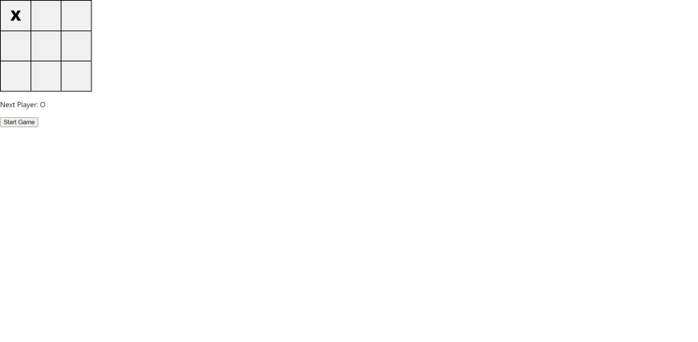
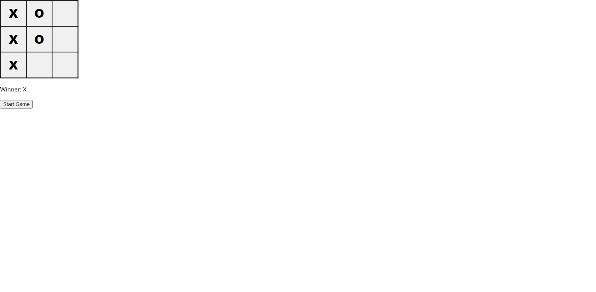
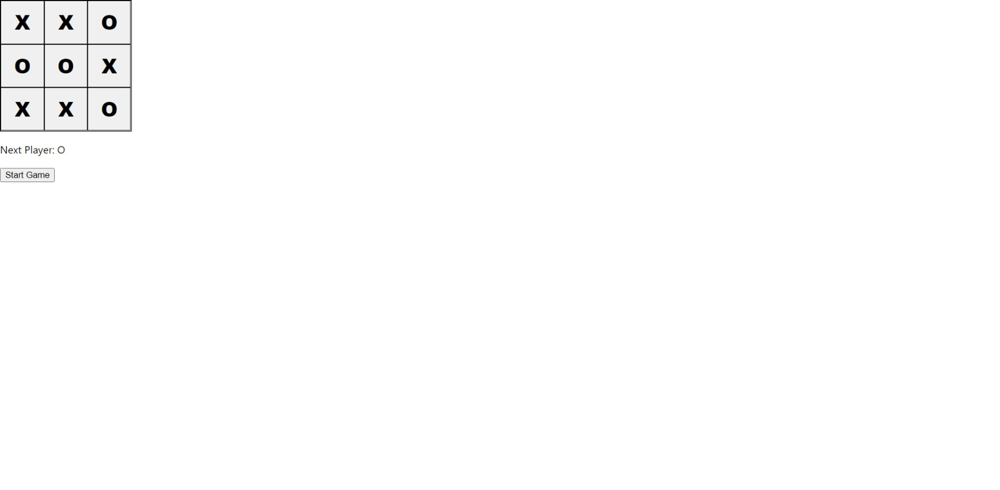

# 10: Recap

## Preparation

Use the repository from the previous **Formative Assessment**. Create a new branch called `10-playground`. Checkout to the `10-playground` branch and open the repository in **Visual Studio Code**.

---

## Create React App

To get started, run the following commands: 

```bash
npx create-react-app tic-tac-toe
cd tic-tac-toe
```

**Resource:** <https://create-react-app.dev>

---

## Tic-Tac-Toe

In the `root/src` directory of the `tic-tac-toe` application, create a new directory called `components`.

### src/components/Square.js

In the `components` directory, create a new file called `Square.js`. In the `Square.js` file, add the following code:

```jsx
const Square = (props) => {
  const style = {
    border: '1px solid #000',
    cursor: 'pointer',
    fontSize: '30px',
    fontWeight: '800',
    outline: 'none',
  };

  return (
    <button style={style} onClick={props.onClick}>
      {props.value}
    </button>
  );
};

export default Square;
```

**What is happening?**

1. A `Square` has two `props` - `value`, i.e., **X**, **O** or `null` and `onClick` which will be passed down to the `Board.js` file or `Board` **component** then to the `Square.js` file or `Square` **component**.

**Resource:** <https://reactjs.org/docs/components-and-props>

### src/components/Board.js

In the `components` directory, create a new file called `Board.js`. In the `Board.js` file, add the following code:

```jsx
import Square from './Square';

const Board = (props) => {
  const style = {
    border: '1px solid #000',
    display: 'grid',
    gridTemplate: 'repeat(3, 1fr) / repeat(3, 1fr)',
    height: '200px',
    width: '200px',
  };

  return (
    <div style={style}>
      {props.squares.map((square, idx) => (
        <Square key={idx} value={square} onClick={() => props.onClick(idx)} />
      ))}
    </div>
  );
};

export default Board;
```

**What is happening?**

1. Mapping through the `squares` **prop**, i.e., an `Array` of size 9 which is declared in the `Game.js` file or `Game` **component**. 
2. Declare a `Square` for each `square` in the `squares` **prop**. Each `Square` must have a `key`. It tells **React** which items have been added, changed or removed.

**Resource:** <https://reactjs.org/docs/lists-and-keys>

In the `src` directory, create a new directory called **utils**. Create a new **JavaScript** file called `index.js`.

```javascript
const calculateWinner = (squares) => {
  const lines = [
    [0, 1, 2],
    [3, 4, 5],
    [6, 7, 8],
    [0, 3, 6],
    [1, 4, 7],
    [2, 5, 8],
    [0, 4, 8],
    [2, 4, 6]
  ];

  for (let s = 0; s < lines.length; s++) {
    const [a, b, c] = lines[s];
    if (squares[a] && squares[a] === squares[b] && squares[a] === squares[c]) {
      return squares[a];
    }
  }
  return null;
}

export default calculateWinner;
```
**What is happening?**

1. Declaring and export a function called `calculateWinner`. This function accepts a parameter called `squares` which represents the current board state. When you start a new game of **tic-tac-toe**, the board state will look like the following:

```javascript
[
  null, null, null,
  null, null, null,
  null, null, null,
]
```

2. Declaring a **2D array** called `lines`. This contains all the possible winning combinations.
3. Iterating through the length of `lines`. Use destructuring to access each index in each line. For example, `[a => 0, b => 1, c => 2]`, `[a => 3, b => 4, c => 5]`, etc. This means you do not need to access each line using `[idx][idx]`.
4. Checking if `squares[a]` (first position) in `squares` contains the value **X** or **O**. If `true`, compare the value in `squares[a]` with the value in `squares[b]` (second position) and the value in `squares[a]` with the value in `squares[c]` (third position), then return the value in `squares[a]` (winner). Otherwise, return `null`.

### src/components/Game.js

In the `components` directory, create a new file called `Game.js`. In the `Game.js` file, add the following code:

```jsx
import { useState } from 'react';
import calculateWinner from '../utils/calculateWinner';
import Board from './Board';


const Game = () => {
  const style = {
    width: '200px',
  };

  const [board, setBoard] = useState(Array(9).fill(null));
  const [xIsNext, setXIsNext] = useState(true);

  const winner = calculateWinner(board);

  const handleClick = (idx) => 
    const boardCopy = [...board];
    if (winner || boardCopy[idx]) return;
    boardCopy[idx] = xIsNext ? 'X' : 'O';
    setBoard(boardCopy);
    setXIsNext(!xIsNext);
  };

  const startGame = () => (
    <button onClick={() => setBoard(Array(9).fill(null))}>Start Game</button>
  );

  return (
    <>
      <Board squares={board} onClick={handleClick} />
      <div style={style}>
        <p>
          {winner
            ? `Winner: ${winner}`
            : `Next Player: ${xIsNext ? 'X' : 'O'}`
          }
        </p>
        {startGame()}
      </div>
    </>
  );
};

export default Game;
```

**What is happening?**

1. Declaring three states - `board` and `xIsNext` using the `useState` hook and fill it with initial data. Also, you will need a way of setting a state's value - `setBoard` and `setXIsNext`. 
2. Declaring a function called `handleClick` which accepts a parameter called `idx`. Declaring a variable called `boardCopy` and assign its value to a shallow copy of the current `board` state using the [spread operator](https://developer.mozilla.org/en-US/docs/Web/JavaScript/Reference/Operators/Spread_syntax) (horizontal ellipsis). Return if there is a winner or if a `Square` in `boardCopy` contains a value that is not `null`. Setting a `Square` in `boardCopy` to either **X** and **O** based on the current `xIsNext` state. Setting the `board` state to `boardCopy` using the `setBoard` function and `xIsNext` to `!xIsNext` using the `setXIsNext` function.
3. Declaring a function called `startGame` which returns a `button`. The `button` has an `onClick` listener which resets and the fills the `Array` of size 9 to `null`.
4. Returning a `Fragment` containing a `Board`. In the `div`, if `winner` is `true`, display the winning value (**X** or **O**). Otherwise, display the next value based on the current `xIsNext` state. Also, declare `startGame` which renders the button mentioned above.

### src/App.js

In the `App.js` file, replace the existing code with the following code:

```jsx
import Game from './components/Game';

const App = () => <Game />;

export default App;
```

---

## Testing

Navigate to <http:localhost:3000> and test the changes before you move on to the **Formative Assessment** section.

The screenshot below is an example of an empty board.


The screenshot below is an example of square set to **X**. 



The screenshot below is an example of the **X** win state.



The screenshot below is an example of the **O** win state. 


The screenshot below is an example of the draw state.



## Formative Assessment

### Task Tahi

If you have not already, implement the code examples above before you move on to **Task Rua**. 

### Task Rua

Create a function that checks the draw state. Display "Draw" if the draw state is true. Test the changes before you move on to the **Code Review**.

### Code Review

Once you have completed all tasks, open a pull request and assign **grayson-orr** as a reviewer. Please do not merge the pull request.
